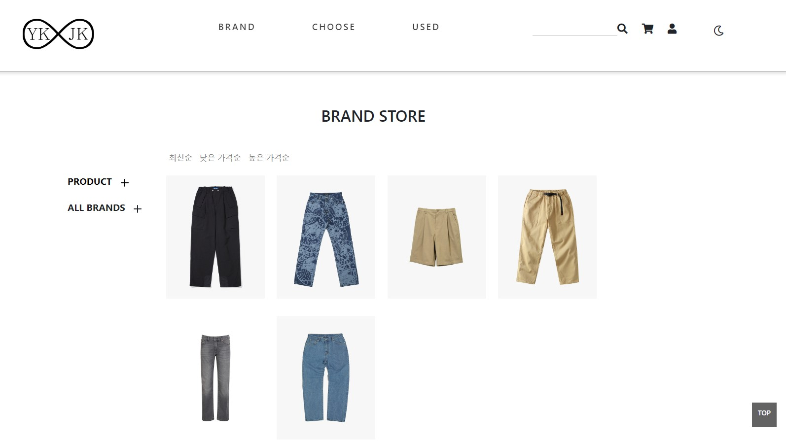

# **Project - Clothing Shopping_mall** 

 ## 💡 `Spring` PROJECT      


---

### 🧾 프로젝트 소개 

---

>**ECLIPSE 환경 구축**

> 1. ECLIPSE 설치
> 2. JDK 설치
> 3. Oracle 설치 
> 4. Tomcat 설치

###### Eclipse Marketplace
> 5. Spring Tools 3 Add-On for Spring Tools 4 [3.9.22.RELEASE] 설치
> 6. Eclipse Enterprise Java and Web Developer Tools 3.20 설치
 
---

## [Set Up]

<br>

#### [ver_0]

◾ **의류 온라인 쇼핑몰** `Version_0`

---

#### [ver_1.0]

◾ **의류 온라인 쇼핑몰** `Version_1.0` 

- 데이터베이스 수정
    - YKJK 변경
    - 이메일 변경
- Front-End
    - Logo 변경(YKJK - Header, Footer)
    - Header Navigation bar `slide` 추가 ▶ 연동 필요

---

#### [ver_2.0]

◾ **의류 온라인 쇼핑몰** `Version_2.0`

- Front-End
    - Logo 변경(YKJK - Header, Footer)
    - Header Navigation bar `slide` 추가 ▶ 연동 완료
    - Navigation bar - 'BRNAD', 'CHOOSE', 'USED' 메뉴 확정
        - BRNAD, CHOOSE, USED 상세 메뉴 추가
    - 전체 상품 이미지 변경
        - 이미지 겹침 또는 상품 분류 확인 필요<br>
    - 상품 메뉴 이미지        
    

---

#### [ver_3.0]

◾ **의류 온라인 쇼핑몰** `Version_3.0`
- 일부 사진 불러오기 실패
    - 데이터베이스 수정하여 데이터 안 넘어오는 현상 수정

---

#### [ver_3.2]

◾ **의류 온라인 쇼핑몰** `Version_3.2`
- 상품 목록 세분화 작업
    - 1차 테스트 완료
        - (추후 최종적으로 추가 작업 및 테스트 작업 있을 예정)

#### [ver_3.5]

◾ **의류 온라인 쇼핑몰** `Version_3.5`
- 업체 로그인 / 일반 회원 로그인 분리
    - 분리 및 체크 완료

---

#### [ver_4.0]

◾ **의류 온라인 쇼핑몰** `Version_4.0`
- 로그인 시 일부 버튼 동작 오류 수정
    - 체크 완료
- 회원가입 오류 수정
    - 회원가입 데이터베이스 연동 실패로 데이터베이스 수정  

---

#### [ver_4.5]

◾ **의류 온라인 쇼핑몰** `Version_4.5`
- 상품등록 및 삭제 기능 체크
    - 체크 완료
- 장바구니 담기 기능 체크
    - 체크 완료

---

#### [ver_5.0]

◾ **의류 온라인 쇼핑몰** `Version_5.0`
- 결제 시스템(API) 체크
    - 정상 작동<br>
        -> 테스트 목적으로 결제 금액은 100원으로 동일하게 지정

---

#### [ver_6.0]

◾ **의류 온라인 쇼핑몰** `Version_6.0`
- Merge: dev1(front_end & back_end) + dev2(database)
    - 작업 완료

---

#### [ver_7.0]

◾ **의류 온라인 쇼핑몰** `Version_7.0` TEST 준비
- Merge: dev3(TEST BRANCH) + dev1(merging testking)
    - 작업 완료
    - 테스트 준비

---
---

#### [TEST_1.0]

◾ **의류 온라인 쇼핑몰** `Version_1.0` TEST 
- 테스트 1
    - 일부 버그 수정
        - 상품 목록 페이지로 잘 안 불러와 지는 현상 수정

---

#### [TEST_2.0]

◾ **의류 온라인 쇼핑몰** `Version_2.0` TEST 
- 테스트 2
    - 상품 목록 오류 수정
    - 최종 버그 수정
    - 최종 테스트 완료

---
---
#### [Release 1.0]

◾ **`Release1.0`**

### ◾ main


### ◾ clothes menu




### ◾ clothes details


### ◾ cart


### ◾ payment


### ◾ dark mode


<br>


###### `Notion` : https://www.notion.so/Team-Project3-Spring-5b7960e2e0f44f80a0df241612c2a339

```


```

